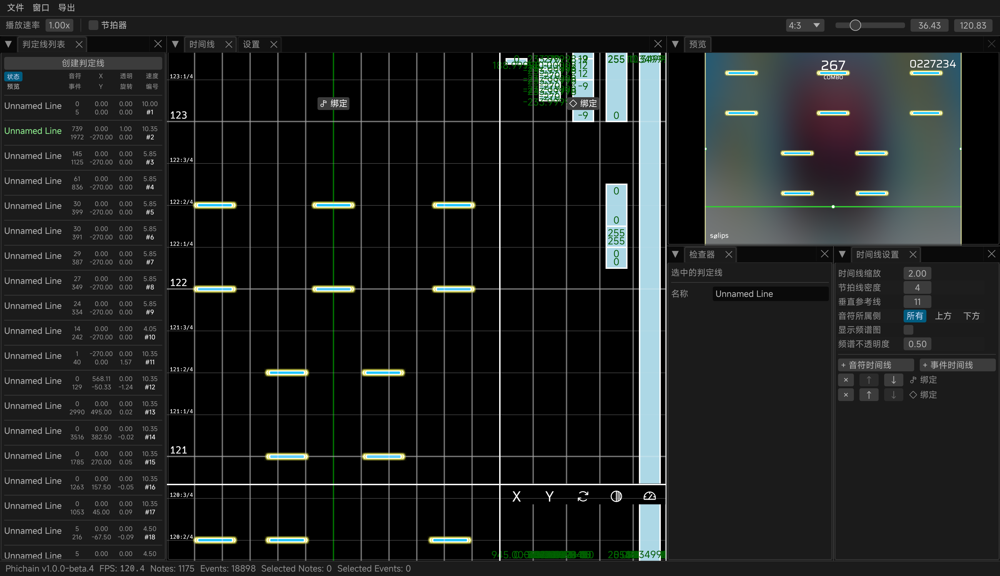

> [!WARNING]
> 仍处于开发的早期阶段，可能存在不完整的功能和未预期的行为

## Phichain

**中文** | [English](https://github.com/Ivan-1F/phichain/blob/master/README_en.md) | [日本語](https://github.com/Ivan-1F/phichain/blob/master/README_ja.md)

基于 Rust 和 Bevy 的 Phigros 制谱工具链

- QQ 群: [768476938](https://phicha.in/qq)
- Discord: [discord.gg/ESUwcdMBPv](https://phicha.in/discord)

## 致谢

- [cmdysj](https://space.bilibili.com/252635690) 的 Re:PhiEdit
- `assets/image` 和 `assets/audio` 目录下的资源文件来自 [https://github.com/MisaLiu/phi-chart-render], 并且遵循 [CC BY-NC 4.0](https://creativecommons.org/licenses/by-nc/4.0/) 许可协议
