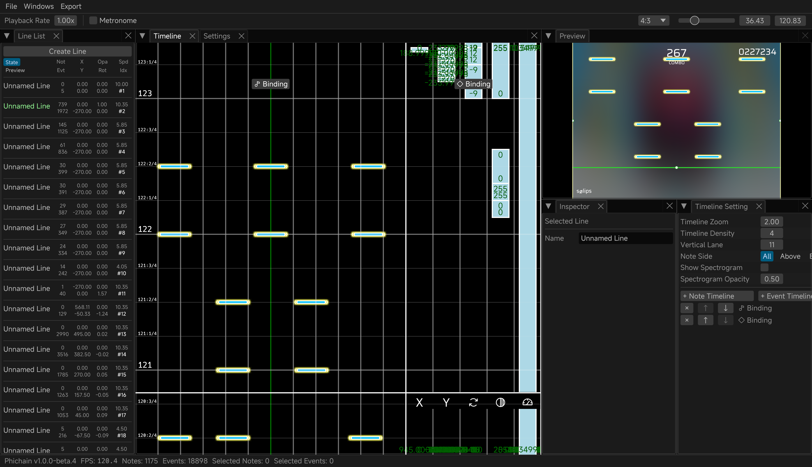

> [!WARNING]
> Still in early stages of development, expect incomplete feature and unexpected behavior

## Phichain

[中文](https://github.com/Ivan-1F/phichain/blob/master/README.md) | **English** | [日本語](https://github.com/Ivan-1F/phichain/blob/master/README_ja.md)

Phigros charting toolchain written in Rust and Bevy

- QQ Group: [768476938](https://phicha.in/qq)
- Discord: [discord.gg/ESUwcdMBPv](https://phicha.in/discord)

## Thanks

- Re:PhiEdit by [cmdysj](https://space.bilibili.com/252635690)
- The resource assets under `assets/image` and `assets/audio` are from [https://github.com/MisaLiu/phi-chart-render],
  and are licensed under [CC BY-NC 4.0](https://creativecommons.org/licenses/by-nc/4.0/)
