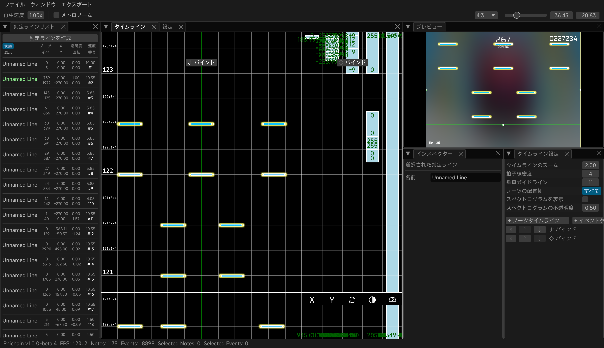

> [!WARNING]
> このソフトウェアはまだ開発の初期段階にあり、機能が不完全であったり、予期せぬ動作が発生したりする可能性があります。

## Phichain

[中文](https://github.com/Ivan-1F/phichain/blob/master/README.md) | [English](https://github.com/Ivan-1F/phichain/blob/master/README_en.md) | **日本語**

RustとBevyをベースにしたPhigrosの譜面制作ツールチェインです。

- QQグループ: [768476938](https://phicha.in/qq)
- Discord: [discord.gg/ESUwcdMBPv](https://phicha.in/discord)

## 謝辞

- [cmdysj](https://space.bilibili.com/252635690) 氏の Re:PhiEdit
- `assets/image` および `assets/audio` ディレクトリ内のアセットファイルは [https://github.com/MisaLiu/phi-chart-render] に由来し、[CC BY-NC 4.0](https://creativecommons.org/licenses/by-nc/4.0/) ライセンスに従います。
