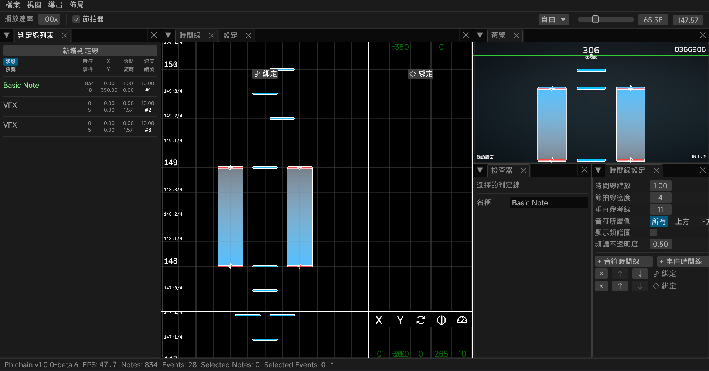

> [!WARNING]
> 仍然處於早期開發階段，可能有不完整的功能和非預期行為。

## Phichain

[简体中文](https://github.com/Ivan-1F/phichain/blob/master/README.md) | **繁體中文** | [English](https://github.com/Ivan-1F/phichain/blob/master/README_en.md) | [日本語](https://github.com/Ivan-1F/phichain/blob/master/README_ja.md)

基於 Rust 和 Bevy 的 Phigros 製譜工具鏈

- QQ 群：[768476938](https://phicha.in/qq)
- Discord：[discord.gg/ESUwcdMBPv](https://phicha.in/discord)

## 致謝

- [Phira](https://github.com/teamflos/phira)
- [cmdysj](https://space.bilibili.com/252635690) 的 Re:PhiEdit
- `assets/image` 和 `assets/audio` 路徑下的資源檔案來自 [https://github.com/MisaLiu/phi-chart-render]，並且遵守 [CC BY-NC 4.0](https://creativecommons.org/licenses/by-nc/4.0/) 許可協議
